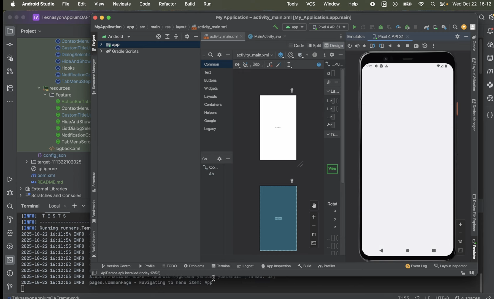

# 🚀 Teknasyon Appium QA Automation Framework

> **A modern, scalable, and reusable Appium-based QA automation framework for mobile testing.**

## 🚀 Demo Video

---

## 🧩 Overview

This framework has been developed to accelerate test processes, ensure reusability, and detect issues early in **Teknasyon’s** mobile applications.  
It supports both **Android** and **iOS** platforms and provides an easy way to manage and execute automated mobile tests.

### ✨ Key Features
- 🌐 Cross-platform support (Android & iOS)
- 🧠 Modular structure using **Page Object Model (POM)**
- ⚙️ Parallel test execution support
- 📸 Automatic screenshot capture on failure
- 🧾 Detailed reporting with **Allure**
- 🧪 Optional **Cucumber BDD** integration

---

## 🏗️ Tech Stack

| Technology     | Description |
|----------------|-------------|
| **Java 17**    | Core programming language |
| **Appium 3.x** | Mobile automation framework |
| **TestNG**     | Test execution framework |
| **Maven**      | Build and dependency management |
| **Allure**     | Test reporting |
| **SLF4J**      | Logging utility |

---

## 📁 Project Structure

## 🏃 Running Tests
To execute the test cases in this framework, ensure that you have completed the necessary configuration as described in the Configuration section and that the Appium server is running. Follow these steps to run the tests:

**Start the Appium Server:** Ensure that the Appium server is running and accessible. The URL for the Appium server should match the value set in the `BaseDriverFactory`

### Runs only tests tagged with @Regression
mvn test -Dcucumber.filter.tags="@Regression"

## 📊 Generating Reports
### Generate the Allure report (cleans previous results)
allure generate (target-file name)/allure-results -o target/r

### Open the generated report in your browser
allure open target/allure-report

# Kadir Atalı 🧑‍💻

**📍 QA Automation Engineer**

[💼 LinkedIn](https://www.linkedin.com/in/kadir-atali/) | [🐙 GitHub](https://github.com/kadiratali)

